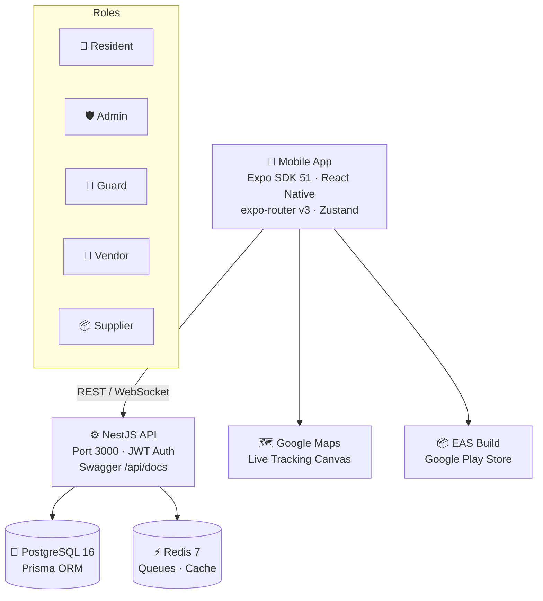

<div align="center">

# 🏘️ AMA Smart Society SuperApp

**All-in-one society management platform for residents, admins, guards, vendors & suppliers**

[](https://github.com/hadhvikcc-ux/ama-society/actions/workflows/ci.yml)
[](https://www.typescriptlang.org/)
[](https://expo.dev)
[](https://nestjs.com)
[](LICENSE)

[Features](#-features) · [Architecture](#-architecture) · [Quick Start](#-quick-start) · [API Docs](#-api-documentation) · [Play Store](#-google-play-store)

</div>

---

## ✨ Features

| Module | Role | Description |
|--------|------|-------------|
| 🔐 **Auth & RBAC** | All | JWT login, role-based route guards, OTP verification |
| 🚪 **Gate Management** | Guard / Resident | Visitor QR pass, delivery scan, vehicle lookup |
| 💳 **Billing & Payments** | Resident / Admin | Maintenance bills, UPI payment, ledger, invoices |
| 🎫 **Cab / Auto Booking** | Resident | 4 vehicle tiers, society pickup points, `CP-XXXX` gate pass |
| 🗺️ **Live GPS Tracking** | Resident | Google Maps canvas, real Bangalore routes, 3 map styles |
| 🏪 **Bazaar Marketplace** | Resident / Vendor | Bidding, OCR scanner, POS, cart, delivery tracking |
| 🔧 **Tickets & Work Orders** | Resident / Vendor | Raise complaints, assign vendors, PDF work order |
| 📅 **Facility Booking** | Resident | Clubhouse, pool, gym — time-slot reservation |
| 💬 **Community Chat** | All | Channels: Announcement, General, Committee, Security Alert |
| 📢 **Events & Polls** | Resident / Admin | Pool-funded events, voting, surplus cashback |
| 🏠 **Domestic Staff** | Resident | Staff directory, entry logs, background check status |
| 📦 **Parcel Locker** | Resident / Guard | Parcel OTP pickup, tracking |
| 🚗 **Vehicle Registry** | Resident / Guard | Vehicle registration, wrong parking report |
| 📋 **Society Admin** | Admin | Society config, member management, billing cycles |
| 🤖 **E2E Test Bot** | Admin | 21 suites / 59 scenarios, floating FAB, admin-only |

---

## 🏗️ Architecture



### Monorepo Structure

```
ama/
├── apps/
│   └── mobile/              # Expo React Native app
│       ├── app/             # expo-router screens (file-based routing)
│       │   ├── (resident)/  # Resident role screens
│       │   ├── (admin)/     # Admin role screens
│       │   ├── (guard)/     # Guard role screens
│       │   ├── (vendor)/    # Vendor role screens
│       │   └── auth/        # Login / Register
│       ├── components/      # Shared UI components
│       ├── stores/          # Zustand state stores (30+)
│       └── utils/rbac.ts    # Single-source RBAC config
├── packages/
│   ├── api/                 # NestJS REST API
│   │   ├── src/             # Modules: auth, gate, billing, tickets…
│   │   └── prisma/          # Schema + migrations
│   └── shared/              # Shared TypeScript types & enums
├── docs/play-store/         # Google Play Store assets & runbook
├── docker-compose.yml       # PostgreSQL + Redis + API
└── turbo.json               # Turborepo pipeline
```

---

## 🚀 Quick Start

### Prerequisites

| Tool | Version |
|------|---------|
| Node.js | v20+ |
| pnpm | v9+ |
| Docker & Docker Compose | Latest |
| Expo Go / EAS CLI | Latest |

### 1. Clone & Install

```bash
git clone https://github.com/hadhvikcc-ux/ama-society.git
cd ama-society
pnpm install
```

### 2. Environment Setup

```bash
cp .env.example .env
# Edit .env — add your DB URL, JWT secrets, etc.
```

### 3. Start Infrastructure

```bash
docker-compose up -d          # Starts PostgreSQL + Redis
```

### 4. Database Setup

```bash
cd packages/api
npx prisma migrate dev        # Run migrations
npx prisma db seed            # Seed sample data
```

### 5. Run Development Servers

```bash
# From monorepo root — starts all services via Turborepo
pnpm dev

# Or individually:
pnpm --filter @ama/api dev           # NestJS API on :3000
pnpm --filter @ama/mobile start      # Expo Metro on :8081
```

---

## 📚 API Documentation

Once the API is running, visit:

```
http://localhost:3000/api/docs     # Swagger UI
```

### Key Endpoints

| Method | Endpoint | Description |
|--------|----------|-------------|
| `POST` | `/api/v1/auth/login` | Login with email + password |
| `POST` | `/api/v1/auth/register` | Register new user |
| `GET`  | `/api/v1/gate/visitors` | List visitor passes |
| `POST` | `/api/v1/gate/scan` | Scan QR at gate |
| `GET`  | `/api/v1/billing/invoices` | List invoices |
| `POST` | `/api/v1/tickets` | Create complaint ticket |
| `GET`  | `/api/v1/bazaar/items` | List marketplace items |

---

## 📱 Google Play Store

The app is configured for Google Play Store distribution via **EAS Build**.

```bash
# Install EAS CLI
npm install -g eas-cli

# Login to Expo account
eas login

# Build Android App Bundle (.aab) for Play Store
pnpm --filter @ama/mobile build:android

# Build APK for testing
pnpm --filter @ama/mobile build:apk
```

**Package**: `com.ama.society`
**See**: [`docs/play-store/play-console-runbook.md`](docs/play-store/play-console-runbook.md)

---

## 🧪 Testing

```bash
# Unit tests (mobile stores + API)
pnpm test

# TypeScript type check
pnpm --filter @ama/mobile tsc --noEmit

# E2E Bot (Admin role only — 21 suites / 59 scenarios)
pnpm --filter @ama/mobile test:bot
```

---

## 🔐 RBAC Roles

| Role | Home Screen | Key Access |
|------|-------------|------------|
| `ADMIN` | Admin Dashboard | Full access + E2E Test Bot |
| `RESIDENT_OWNER` / `RESIDENT_TENANT` | Resident Home | Booking, billing, cab, tracking |
| `GUARD` | Gate Dashboard | Visitor scan, vehicle lookup |
| `VENDOR` | Vendor Dashboard | Work orders, bids |
| `SUPPLIER` | Supplier Dashboard | Inventory, bazaar |

> ⚠️ No screen is accessible without login. All layout guards redirect to `/auth/login`.

---

## 🤝 Contributing

1. Fork the repository
2. Create a feature branch: `git checkout -b feat/your-feature`
3. Commit changes: `git commit -m 'feat: add your feature'`
4. Push to branch: `git push origin feat/your-feature`
5. Open a Pull Request against `main`

---

## 📄 License

MIT © [hadhvikcc-ux](https://github.com/hadhvikcc-ux)
