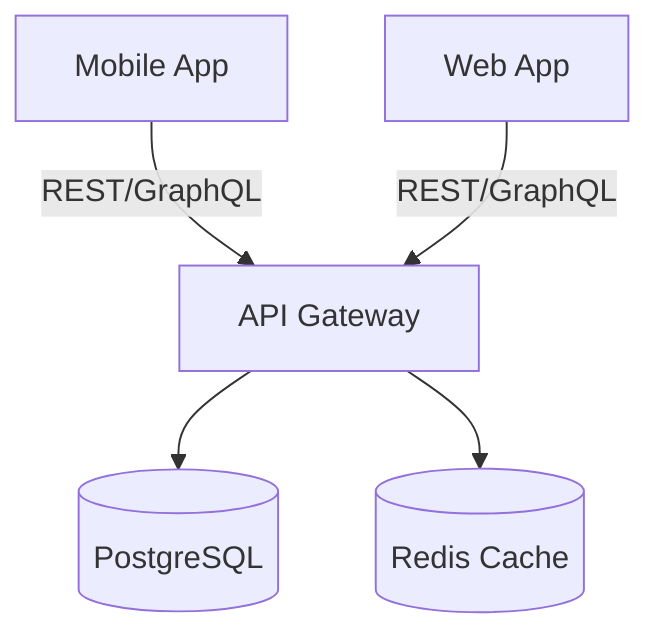

# AMA Monorepo

Welcome to the AMA Monorepo. This repository utilizes **Turborepo** and **pnpm workspaces** for highly optimized full-stack development.

## Prerequisites

- **Node.js**: v20+
- **pnpm**: v9+
- **Docker** & **Docker Compose**

## Quick Start

```bash
# 1. Clone the repository
git clone <repo-url>
cd ama

# 2. Install dependencies
pnpm install

# 3. Setup environment variables
cp .env.example .env
# Edit .env to add required secrets

# 4. Start local infrastructure (DB, Redis)
docker-compose up -d

# 5. Run development server
pnpm dev
```

## Workspace Structure

| Package/App | Path | Description |
| ----------- | ---- | ----------- |
| `@ama/shared` | `packages/shared` | Shared TypeScript interfaces, types, and utility functions |
| `api` | `packages/api` | Backend Express/NestJS service |
| `web` | `apps/web` | Frontend React Application |
| `mobile` | `apps/mobile` | React Native / Expo application |

## Architecture Overview



## Contributing

1. Create a feature branch off `develop`.
2. Ensure you run `pnpm lint` and `pnpm test` locally.
3. Submit a Pull Request.
